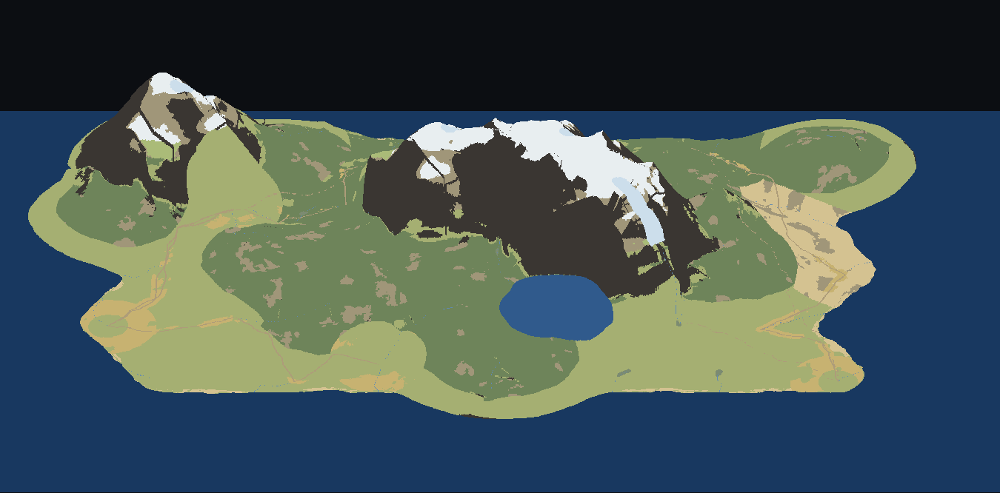

# crawler

A clean-room, ZAngband-style **hex roguelike** written in the
[loft](https://github.com/loft-lang/loft) language.

> **New here? Read [VISION.md](VISION.md) first.** crawler is the **proof and the forcing
> function** for something larger: a stack that lets *small teams* build derived game worlds
> which currently require a studio. This README is the game; VISION.md is what it is for.

The game is moving into **first-person 3D** (plan **#11**), where the hex field built by plans
#5/#9/#10 becomes the world the player stands in. The 2D renderer still runs and retires when
3D reaches parity.

(The loft package is named `story`; `crawler` is the project/repo.)

## The world



The game's overworld — 13.5 × 9.1 km of contract wilderness in **orthographic
relief**, rendered straight from the loft world code (`src/ovshot.loft` samples
`overland.loft` at 10 m/px — heights and kinds — in the in-game palette; the
flat map is [doc/world_loft.png](doc/world_loft.png)). Twin stone massifs under snow, the crater lake, grasslands,
fields and coastal sands; the markers are towns (ringed), ruins and wizard
towers. The depth-0 surface you walk is a 101×101-hex window of exactly this
map, and `ovmap.loft` prints the same world as a ZAngband-style character map —
one deterministic definition, every renderer agrees.

## Why — the anti-moros

`crawler` shares its world model with **moros** (the hex world + heights/layers +
walls/buildings/castles/roads/rock-faces, via `moros_map`/`moros_render`) — but
where moros builds that world **by hand through an editor** (a long content tail),
`crawler` reaches a **working, playable foundation much faster by *generating*
the world procedurally**. Same destination world; code- and generation-driven,
no editor dependency.

## The idea

- **Egocentric, continuous controls.** You glide and turn smoothly; the *world*
  rotates around you (you stay ~70% down the screen, facing up).
- **Distance-driven clock.** Time advances by how far you *travel* — every
  hex-length you move, the world ticks once. **Turning is free.**
- **Hex terrain + overlay structures.** Collision lives on the hex grid (cells,
  edge-walls, height); walls/buildings (12-dir, sharp 90°), roads (24-dir,
  rounded), castles (2-hex ramparts + round towers) and rock faces are a
  render overlay on top.
- **World-keyed & procedural.** Each place is generated deterministically from
  its world position; once visited its state persists, so re-entering restores
  it — and travelling to harder **zones** (not just deeper) drives difficulty.

The game runs on loft's **games kernel** (`engine_host`): a drift-free 60 Hz
fixed-tick loop, deterministic simulation quanta, and a wire so transparent that
`src/observe.loft` renders a live, bit-identical spectator view of a running game
from its intent stream alone (plans/6-games-kernel/). The renderer is a probe-verified
GPU showcase — SDF wall strokes, baked-tint terrain mesh, a directed light cone
(RENDER.md / plans/7-render/).

See **[DESIGN.md](DESIGN.md)** for the full design.

## Controls

| Key | Action |
|---|---|
| `W` / `S` | glide forward / back |
| `A` / `D` | turn left / right (free — no time passes) |
| *(walk onto stairs)* | `>` descend · `<` ascend — no key; step off and back on to re-trigger |
| `.` / `Space` | wait one tick (enemies act, you don't move) |
| `G` | grab the items under you (gold auto-collects) |
| `C` / `I` | character page (spend stat points) / inventory hub |
| `1`-`9`, `Q`, `E` | use the bound quick-slot (potions, the bow, spells) |
| `N` | **next world** — re-scans dropped-in bundles, restarts into a fresh seed |
| `Esc` | quit |

## How to play

You are **`@`**. Glide with `W`/`S` and turn with `A`/`D` — the dungeon rotates
around you. Steer into a monster to attack it (pressing forward into it lands a
hit each tick); you trade blows until one of you dies. Kills earn **XP** — fill
the blue bar under the green HP bar to **level up** (more max HP). Find a **`>`**
down-stair and walk onto it to descend; deeper levels are tougher. The top-left HUD
shows HP, the XP bar + level (`CL`), and the dungeon **DEPTH** (top-right).

On the map:

| Glyph | Meaning |
|---|---|
| `@` (yellow) | you |
| letters (`r` `k` `o` `R` `g` …) | monsters — coloured & lettered by kind (rat, kobold, orc, frog, goblin, …) |
| `>` / `<` | down / up stairs |
| grey cells | rock / walls (the yellow outline traces the cavern edge) |

Monsters spawn **asleep** and wake when you come within sight, so you can
sometimes get the drop on them; once awake they path around walls to reach you.

## Build & run

Needs the **loft toolchain** checked out alongside this repo (defaults to
`../loft`; override with `make play LOFT_REPO=/path/to/loft`).

```sh
make play     # run the game in a window
make test     # headless, deterministic self-tests + compile gate
make game     # build a single self-contained story.html for the browser
make help     # list all targets
```

## Status

**Playable:** roll a race/class hero, cross a generated wilderness between towns,
take quests, descend a monster-populated dungeon, fight in melee / at range / with
spells, loot and equip what you find, level up, and respawn at a save point when you
die. Built so far:

- **Movement & view** — continuous egocentric glide/turn, distance-driven clock
  (turning is free), hex collision with sliding + a player radius, FOV.
- **Combat** — bump-melee, bolts and a bow, castable spells, statuses
  (paralysis / poison / ward), HP + SP pools with natural regen, death → respawn.
- **Overland** — a contract wilderness of towns, roads, rivers, fields, ruins and
  wizard towers; travel between windows, a desert crossing, quests, and settlements
  whose workers gather, produce and now refuse to enter unsafe ground.
- **Dungeon + monsters** — rooms + corridors (world-keyed); monsters drawn by depth
  (rarity-weighted, packs, spawned asleep), awareness + **flow-field pathing**.
- **Character** — races and classes with derived stats, XP and levels, spendable stat
  points, feats/skills, and a shrine that re-specs.
- **Items** — inventory hub, equipment slots, quick-slots (`1`-`9`/`Q`/`E`), gold,
  unknown-item flavours that identify on use.
- **Levels** — `>` / `<` stairs, real depth, deterministic descent, persistence, save points.
- **Content in bundles** — monsters, items, stencils, placement and quests live in
  self-contained `bundles/<name>/` folders the engine merges generically; `N` re-scans
  them and restarts into a fresh world without touching `src/`. (A `production` section
  — what a town's workshops make — is wired on the engine side but has no bundle yet.)
- **Under it** — loft's games kernel (`engine_host`) drives a drift-free 60 Hz tick, and
  the intent wire replays bit-identically into a live spectator (`src/observe.loft`).

**In flight:** first-person 3D (plan #11), which replaces the 2D view at parity. The
ordered backlog is **[DESIGN.md §18a](DESIGN.md)**; what is being worked *right now* is
**[STATE.md](STATE.md)**.

## Layout

```
src/sim.loft       world + player + enemies + combat + AI + XP + statuses + stairs + clock
src/overland.loft  the contract wilderness (towns/roads/rivers/zones); ovmap.loft prints it
src/gen.loft       procedural dungeon generator
src/catalog.loft   merges bundle content into the game's monster/item/race/class tables
src/castfx|itemfx  the verb layer above the kernel — cast a spell, use an item
src/monsters|classes|races|items|spells.loft   clean-room data tables
src/worldmesh.loft terrain mesh (kernel-side; the view only uploads it)
src/wallgeo.loft   wall outline (rounded active; DP straightener parked in patches/)
src/gameflow.loft  the deterministic intent seam; framekey.loft = the scene digest
src/hexscene|view3d|scenemesh|figure   the first-person 3D pass (plan #11)
src/view.loft      the 2D egocentric renderer — retires at 3D parity (plan #11 P9)
src/story.loft     entry: the engine_host game host; observe.loft = live spectator
src/*test.loft     headless tests — 91 files, 93 rows in `make test`
bundles/<name>/    game content, merged generically (see BUNDLE.md)
```

Everything above `view`/`view3d`/`story` imports **no graphics** — the hex geometry
(`hex_grid`) and the exact-integer field core (`hex_field`) are *libraries*, consumed
from `loft-libs-world` rather than carried here. That kernel/view split is exactly what
makes the move to 3D a view-side change.

## Docs

- **[VISION.md](VISION.md)** — **what this is for.** The problem, the thesis, the eight
  principles, and how you would know it worked. Written for a person, not a build.
- **[DESIGN.md](DESIGN.md)** — the full design: pillars (§3a), scope (§3b), architecture
  (kernel/view split), world model, AI / placement / level structure, and the backlog (§18a).
- **[STATE.md](STATE.md)** — where the work stands today; read it after a break.
- **[SCALE.md](SCALE.md)** · **[EXTRACTION.md](EXTRACTION.md)** · **[SCRIPTING.md](SCRIPTING.md)**
  · **[BUNDLE.md](BUNDLE.md)** — the measurement contract, the library plan, how content
  arrives without being scheduled, and the content seam.

## License

LGPL-3.0-or-later, consistent with the loft ecosystem.
